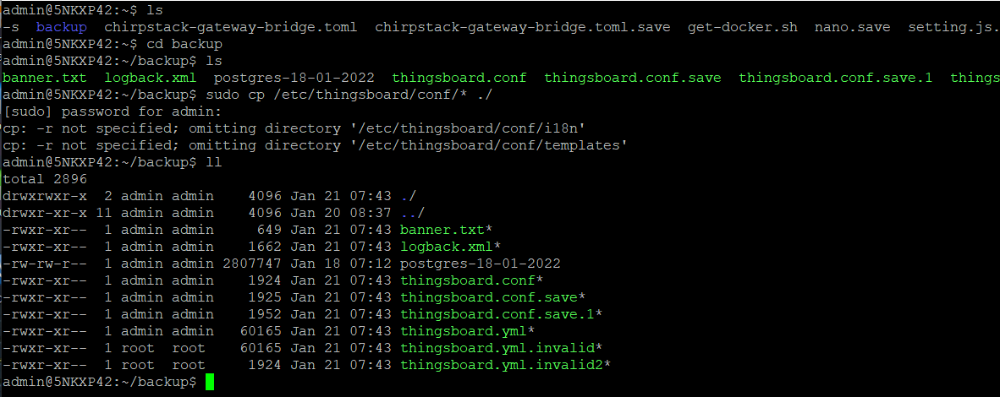
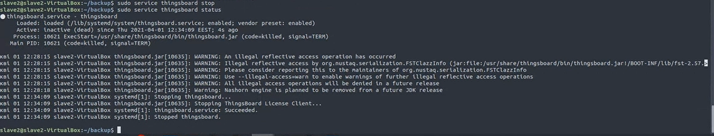
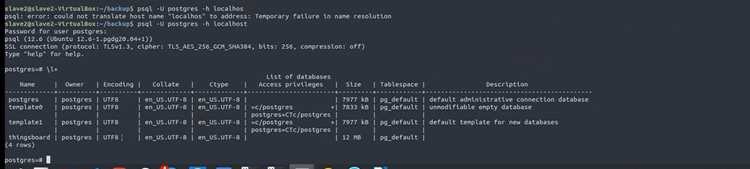
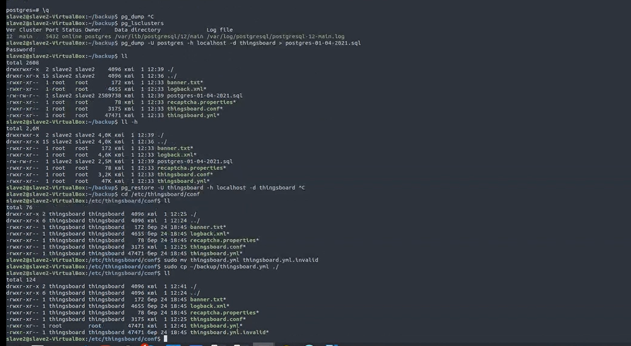

# Configure-PostgreSQL-ThingsBoard-database
```bash
ThingsBoard is able to use SQL or hybrid database approach
```
- After Installing the Thingsboard PE on Ubuntu machine: What is necessary to back up the whole machine or only the database?

- After installation the thingsboard on our `Ubuntu-machine` we can log thingsboard service.
```
$ less /var/log/thingsboard/thingsboard.log
```
- After that press `Ctrl+n` to view the latest input and check it.

## Backup Database
```
Make a backup folder for the database.
```
- Create a backup folder
```
$ mkdir backup
```
- Enter the backup folder
```
$ cd backup
```
- Now, we can copy everything to the current folder.
```
$ sudo cp /etc/thingsboard/conf/* ./
```
By `*asterisk` we can copy everything from previous folder to the new folder.

- To check the copy file
```
$ ll 
```


- Basically, we need `thingsboard.yml` and `thingsboard.conf` files.

- After the backup procedure, we need to stop the things board service.

## Configuration

- Service management commands:
```
sudo service postgresql stop
sudo service postgresql start
sudo service postgresql restart
```
- To check the status
```
$ sudo service thingsboard status
```



- Enter the database to check the free space of database.

- Use `psql-console` to enter the database
```
$ psql -u postgres -h localhost
```
- Now we will get the details of database.
```
\l+
```



- check the disk space, logout from database and write this command.
```
$ df -h /
```
- Make sure we have enough space to place a backup of the database
`Check database size`
```
$ sudo -u postgres psql -c "SELECT pg_size_pretty( pg_database_size('thingsboard') );"
```

- Make sure our PostgreSQL database is running
```
$ pg_lsclusters
```
- If there is enough free space - make a backup.
```
$ pg_dump -U postgres -h localhost -d thingsboard > "specify the file"
```
- Enter the password of `postgres` not out machine.

- Finally, we can check the backup file which is created.
```
$ ll -h  
```
- Restore the folder for any trouble
```
$ pg_restore -U thingsboard -h localhost -d thingsboard > "File name"
```

- To copy the config file
```
$ cd /etc/thingsboard/conf
$ ll
$ sudo mv thingsboard.yml thingsboard.yml.invalid
$ sudo cp ~/backup/thingsboard.yml ./
```

- Now we can see the copy folder
```
$ ll
```


- After finishing the backup processing, to start the thingsoard service.
```
$ sudo service thingsboard start
```

## File Storage
- Where are located the files with the application, like configuration files, rule chain, widget and dashboard so on?
- ThingsBoard has ability to store binary content (files) in the DataBase. Currently it is used to store report files generated by Generate Report Node. 
  Stored files are accessed by Send Email Node to create email attachments. Another way to send a file is the REST API Call Node. 
  User can access stored files using Files or Reports widgets which is part of Files Widgets Bundle.

- Enter the thingsboard config file
```
$ cd /etc/thingsboard/conf
$ ll
```
- To check the user share file of thingsboard and look what we have here
```
$ cd /usr/share/thingsboard
$ ll
```

- Enter the "bin" folder
```
$ cd bin
$ ll
```

- Basically it's executable and some instance and installed data etc. We have config file where we will see `data` folder and here we can see the certificate and some third       party related data.
 
- Enter the extension folder, which is use for custom developed role node like rule chains.
```
$ cd extensiions/
$ ll
```


